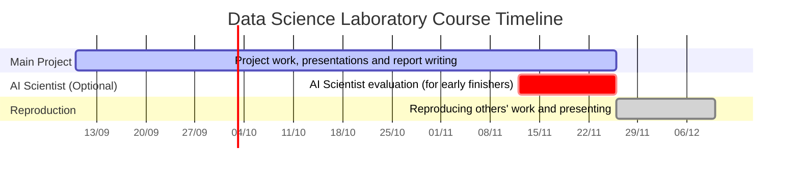

# 2026 Data science laboratory - dsdatascif17lm, FIZ/3/087
  This repository is for internal administration of the course

**Course Administrator:** David Visontai

**The List of projects and applicants** is [here](ListOfChosenProjects.md)
  
**Location and time of meetings:** The meetings will be held in 5.56 Information technology laboratory and will start always at 12:00PM on Thursday and end the latest at 13:45PM. Most of the time students will give presentations and report on their progress, so it is not obligatory to be present during the whole session, but highly recommended.
  
The goal of the course is to instil practical skills needed for exploratory data analysis. With the acquired knowledge the student shall be able to perform independent research requiring handling of big data. To this end the students will have to explore a couple of longer running projects inspired data intensive problems drawn from multiple fields such as astronomy, genomics and social networks. The students will familiarize themselves with a wide skillset from various software engineering techniques to presenting their well distilled research in a manner that is accessible for the general public.  
  
## Timetable

10/09/2026 -  (**Meeting**) [ Choosing a project](ListOfChosenProjects.md)  
24/09/2026 -  (**Meeting**) [ Presentation I: Description of the chosen topic and plan of action](1-FormatofPresentationsn.md)  
08/10/2026 -  (**Meeting**) Presentation II.  
22/10/2026 -  (**Meeting**) Presentation III. 
12/11/2026 -  (**Meeting**) Final Presentations I.  
26/11/2026 -  (**Meeting** and report submission deadline)  Final Presentations II. or What can an AI Scientist do for you? Evaluation presentations 
10/12/2026 - (**Meeting**) [Presentation of the reproduced works](4-ReproducedReport.md)
   
 ## Timeline of the course

 10/09/2026 - 26/11/2026 Project work, presentations and report writing.  
 12/11/2026 - 26/11/2026 Optionally evaluate AI Scientist on the project for those who completed the project and presented it by 12/11/2026.  
 26/11/2026 - 10/12/2026 Reproducing the work of other students and presenting it.  

## Grading
 * [Final report](2-FormatofReports.md) - *10 points*
 - Quality of the [presentations](1-FormatofPresentations.md) - *10 points* 
 * [Interactive visualization](3-InteractiveVisualization.md) - *10 points*
 * [Reproducibility](4-ReproducedReport.md) - *5 points*

There will be about **15 minutes** allocated for each presenter and **5 minutes** for further discussions.

## Data for the projects
 
 * All the data and other necessary files will be accesible in the Kooplex system, in `/v/volumes/datascilab/` directories
 * If you'd like to access any large file, that is still not there, please notify the administrator
  
## Submission of the reports and presentations
  
 * Any material should be uploaded to the [Kooplex](https://k8plex-edu.elte.hu/) system. If you use another platform for presentation, then supply all necessary informations for accessing that presentation into a file, that will be submitted.
 * Large datafiles (> 100MB), that are produced during the workflow and are necessary for obtaining the final results should be kept also in the `/v/volumes/datascilab/` directory. Before submitting your work, please ask the administrator (David Visontai in this case) to make a copy of it in the right directory 

### Upload notebooks and code

Pleas upload all the *notebooks* and *scripts*, that are needed to reproduce the results!

Please, comment all necessary steps, functions etc.!
Consider another person's approach who will try to read your code:
* what questions will they ask
* which steps are not obvious 
* The notebooks and scripts have to have comments and help text and docstrings bearing in mind that someone in the future might want to reproduce the results

 
## Communication 
 * If you have any technical problem or question, please feel free to file an issue in this github repository so that anyone are able to answer you or see the right answer for that question.
